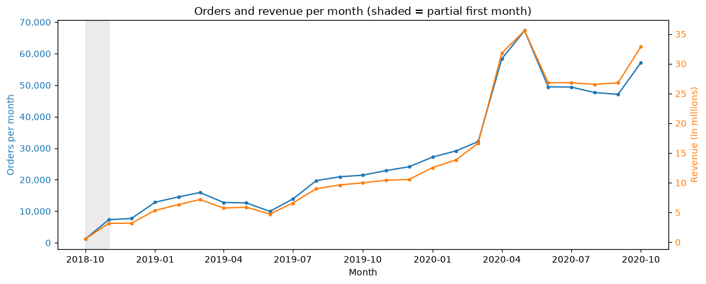
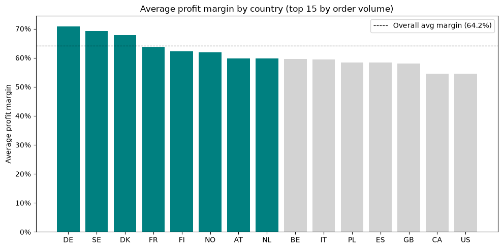

# EDA Case study

## Sample findings

Your task is to find interesting insights in the data that provides value to the stakeholders and visualize and communicate your insights in a clear manner. Follow to the PPDAC cycle when analyzing and visualizing the data. When you find an insight in a plot you write down key words that follows the setup-conflict-resolution framework.

### Examples of questions that could be intresting to investigate:
How has the buisness been performing over time?

Wich countries is the biggest and most profitable markets?

Any time of day that the sales are bigger?

Cost of shipping compared to sales?

Please come up with your own ideas that could be intresting to investigate. Don't get stuck on small details that won't bring any insights instead try to think "can this insight lead to the company taking any action that can increase sales, increase profitability or decrease cost?"